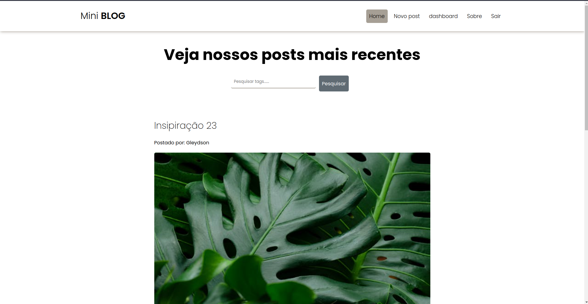
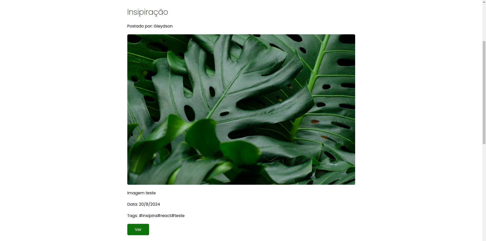
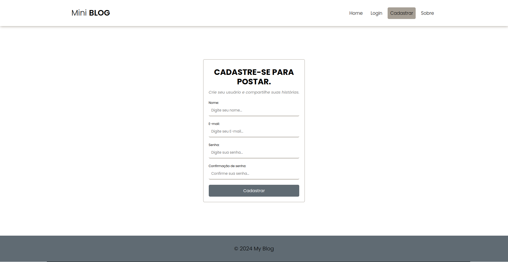
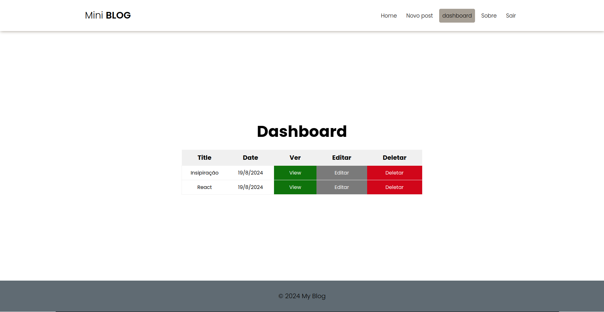
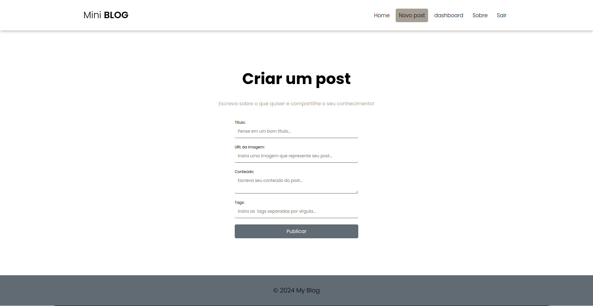

# Mini blog 🌐

 

Bem vindo ao Mini blog. 👋🏻

O mini blog é um projeto aplicado no curso React do zero a maestria do grande professor <a href="https://github.com/matheusbattisti/"  target="_blank"> Matheus Batisti 🔗</a> encontrado na plataforma <a href="https://horadecodar.com.br/"  target="_blank"> Hora de codar 🔗</a>.

Deploy: <a href="https://gleydsonlucena.github.io/secret_word/"  target="_blank"> Crie sua conta e realize seu primeiro post agora mesmo!</a> 🔗

## Tecnologias utilizadas </>

 

### Frontend

<ul>
  <li>ReactJS - com Vite ⚛</li>
  <li>Sass</li>
  <li>React Router Dom 🌐</li>
</ul>

### Backend

<ul>
  <li>Firebase 🔥</li>
</ul>

## Descriçao do projeto 📃

 

Esse projeto consiste em um site de blog, onde o usuário pode criar posts, editar e deletar posts, além de visualizar todos os posts.

Foi utilizado o firebase para armazenar os dados, criar e validar as contas de usuários, e armazenar os posts.

O projeto foi desenvolvido utilizando o framework ReactJS, com o uso de Redux para gerenciar o estado do aplicativo, e o uso de React Router Dom para gerenciar as rotas do aplicativo, e o Sass para estilização.

## Demonstração Home:

  

 

## Demonstração Posts:

  

 

## Demonstração Posts:

  

 

## Demonstração Register:

  

 

## Demonstração Dashboard:

  

 

## Demonstração Create Post:

  

 

## Upgrades e aprendizados 🚀

 

A princípio o projeto aplicado pelo professor era um pouco mais simples, poŕem, eu quis me desafiar e implementar coisas a mais.

### Implementações: 🛠️

<ul>
  <li>Utilização de estados entre todo o componente App, com Context API(useContext).</li>

  <li>Implementação de validações mais robustas no input.</li>

  <li>E um novo desing para praticar um pouco de Sass. 😜</li>
</ul>
